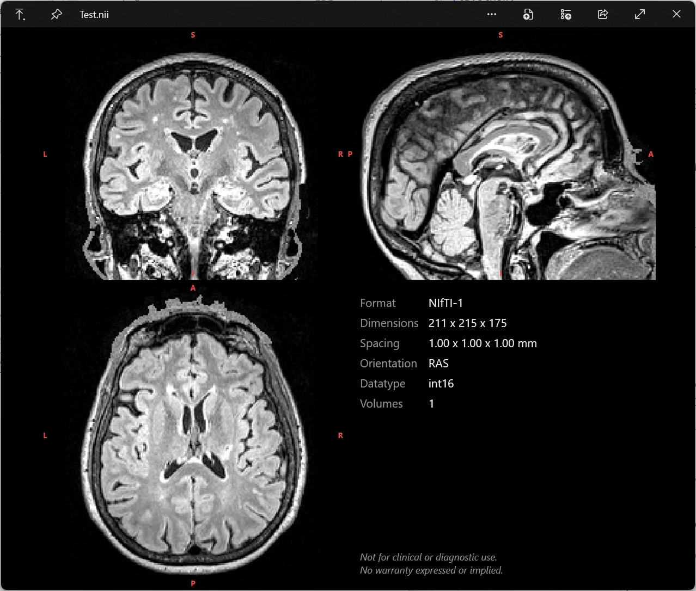

# MIQ-Win — Medical Image QuickLook for Windows

MIQ-Win is a lightweight plugin for the [**Windows QuickLook**](https://github.com/QL-Win/QuickLook) implementation. It previews medical volume images in research formats. Press **Space** on a supported file in Explorer (or any QuickLook-enabled host) to instantly get an **interactive orthogonal slice view** (coronal, sagittal, axial) alongside a metadata panel:

  

MIQ-Win is the Windows counterpart to [**MIQ**](https://github.com/marcoduering/MIQ), the macOS Quick Look extension, and reimplements the core functionality in C#.

## Supported Formats

- :white_check_mark: **NIfTI-1 & NIfTI-2** — `.nii`, `.nii.gz`
- :white_check_mark: **FreeSurfer** — `.mgh`, `.mgz`, `.mgh.gz`
- :white_check_mark: **MRtrix** — `.mif`, `.mif.gz`
- :white_check_mark: **NRRD** — `.nrrd` (single-file; `raw` and `gzip` encodings)

Most formats are supported uncompressed and gzip-compressed. The plugin determines the format from the file extension, so it is **important that files have the correct extensions**. Compound extensions like `.nii.gz` work directly — the plugin matches by path suffix, independent of Windows file associations. NRRD support covers self-contained `.nrrd` files only — detached headers (`.nhdr` with a separate data file) are not previewable.

## Installation & Updates

**Requires [QuickLook](https://github.com/QL-Win/QuickLook/releases)** 4.5 or newer installed on Windows 11! Once QuickLook is installed:

1. 👉 **[Download the latest plugin release (`QuickLook.Plugin.MIQ.qlplugin`)](https://github.com/marcoduering/MIQ-Win/releases/latest/download/QuickLook.Plugin.MIQ.qlplugin)**
   
2. With QuickLook running, press **Space** on the `.qlplugin` file and then **"click here to install this plugin"**.
3. **Restart QuickLook**.
4. Press **Space** on any supported file in Explorer.

### Updating

Repeat the Install procedure with the new plugin version. Your settings are preserved across updates.

### Uninstall

1. **Quit QuickLook** (tray icon → *Quit*) — the plugin DLL is locked while it runs.
2. **Delete the `QuickLook.Plugin.MIQ` folder** from QuickLook's plugin directory (exact location varies by QuickLook version and install type).
3. **Restart QuickLook.**

This does **not** remove your settings, which live in QuickLook's data folder. To delete them too, right-click the QuickLook tray icon → **Open Data Folder** and delete `MIQ.settings.ini`.

## Usage

MIQ-Win is a lightweight convenience tool for quickly inspecting medical image files directly from Explorer. It prioritizes speed and ease of use over advanced visualization, and is not meant to replace dedicated medical image viewers. 

Press **Space** on any supported file to get an instant preview. Navigate between files with the arrow keys, as with any other QuickLook plugin.

The preview is interactive:

- **Scroll** the mouse wheel over any pane to move through that plane's slices.
- **Click** (or drag) in a pane to set the focus point; all three planes link to it, with crosshairs marking the spot.
- **Right-click + drag** to adjust the intensity window/level (brightness/contrast).
- **Alt + scroll** to step through volumes of a 4-D series.

> [!NOTE]
> Advancing between files with the arrow keys requires Explorer to keep keyboard focus. Interacting with the preview by click takes that focus away. Use only the scroll wheel to keep the keyboard focus on Explorer. If the arrow keys stop switching files, click back in the Explorer file list.

### Customization

Preferences live in a plain-text **`MIQ.settings.ini`** — adjust intensity scaling, view orientation, segmentation coloring, axis-label colors, and the metadata panel (content and order of items). Changes apply on the next preview, no restart required. The file is kept in QuickLook's data folder so it survives updates; to open that folder, right-click the QuickLook tray icon and choose **Open Data Folder** (your `MIQ.settings.ini` is inside). A `MIQ settings location.txt` breadcrumb in the plugin folder also points to it.

### Orientation

By default, MIQ-Win displays data **as stored on disk**, without reorienting. Depending on acquisition and processing, images may then appear upside down, mirrored, or rotated. This is intentional: it lets you quickly inspect the raw data including its stored orientation.

For files that carry orientation metadata, two canonical anatomical views are also available via the `Orientation` key in `MIQ.settings.ini`:

- **stored** (default): render axes exactly as stored.
- **neurological**: canonical anatomical view, patient-LEFT on the viewer's left (coronal/axial).
- **radiological**: same, but patient-LEFT on the viewer's right.

Files without orientation metadata always fall back to the stored view.

### Segmentation coloring

By default, every file is shown as grayscale. For **integer label maps** (segmentations), MIQ-Win can instead color each label, enabled via the `SegmentationColors` key in `MIQ.settings.ini`:

- **off** (default): grayscale, as before.
- **auto**: detected label volumes are colored. **FreeSurfer** segmentations (`aseg`/`aparc`) use their canonical colors; other label maps get distinct per-label colors. A binary mask (single label) is shown white.
- **random**: as auto, but always uses per-label colors (never the FreeSurfer palette).

Detection is conservative, so ordinary intensity images should stay grayscale.

### Performance

Uncompressed files load instantly. All gzip-compressed files (`.nii.gz`, `.mgh.gz`/`.mgz`, `.mif.gz`) are decompressed with native [libdeflate](https://github.com/ebiggers/libdeflate) — far faster than .NET Framework's built-in gzip. Multi-volume NIfTI previews even quicker because only the **first volume** is shown for the initial view — for every `.nii.gz`, and for uncompressed `.nii` over 150 MB. This is especially helpful on slow or network storage, where the preview appears without waiting for the whole file, and you can flick through many large files seeing just the first volume of each. The remaining volumes load on demand the first time you use the volume scrubber. Very large `.mgz` or `.mif.gz` files are decompressed in full up front, so they may take a few seconds. Extremely large 4-D series (over ~2 GB) are previewed using their first volume only — the metadata panel notes this and the volume scrubber is hidden.

## Active Development

This plugin is still in development and was created with the support of AI coding agents. Please report issues or feature suggestions via [**GitHub Issues**](https://github.com/marcoduering/MIQ-Win/issues). Contributions are welcome.

If MIQ-Win is useful to you and you'd like to support its development, you can [**sponsor the project**](https://github.com/sponsors/marcoduering). Entirely optional, always appreciated.

## Disclaimer & License

MIQ-Win is provided "as is" under the [MIT License](./LICENSE), without warranty of any kind, express or implied. The authors and contributors accept no liability whatsoever for any direct, indirect, incidental, special, or consequential damages arising from the use or inability to use this software, including but not limited to data loss, incorrect image rendering, or any decisions made on the basis of previews generated by this tool.

> [!CAUTION]
> This software is **<ins>not</ins> a medical device and is <ins>not</ins> intended for diagnostic use**. It is a developer and researcher convenience tool only. Do not use it to make clinical decisions.
